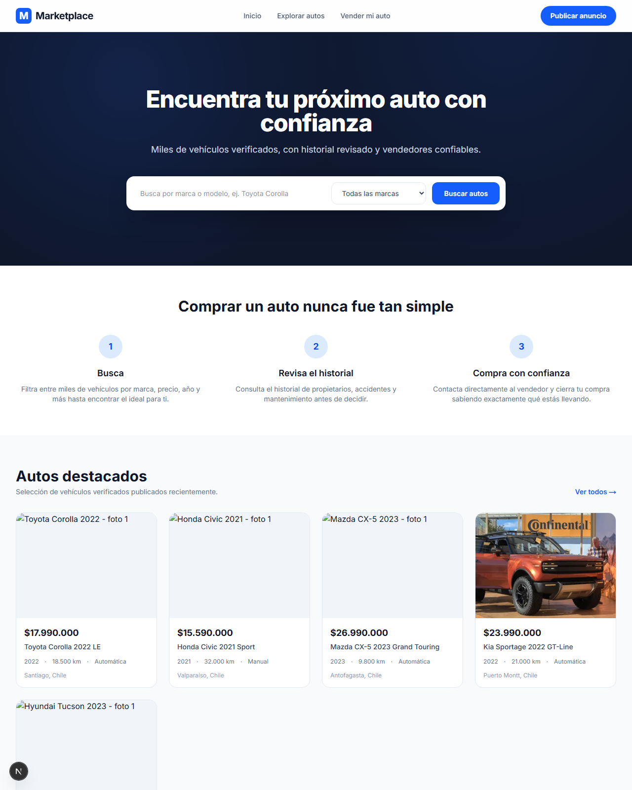
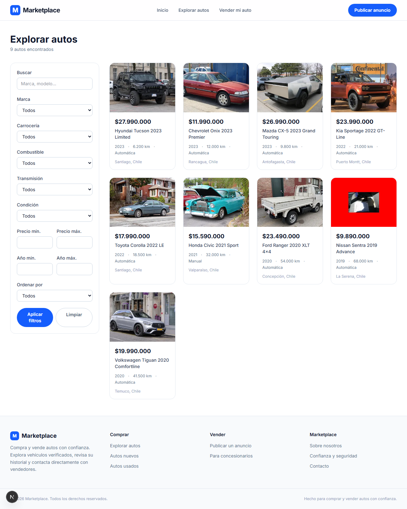
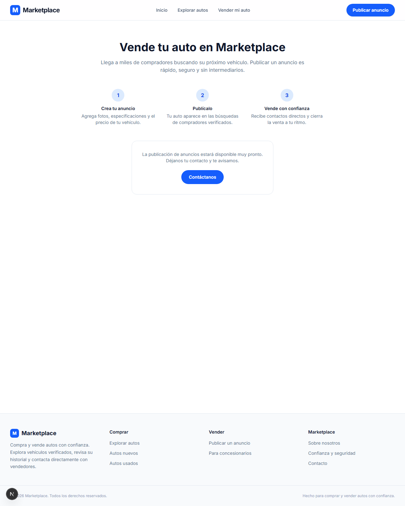

# Marketplace Web — Frontend de un marketplace de autos


Aplicación web para comprar y vender autos con confianza: los vendedores publican
vehículos y los compradores buscan, filtran, revisan el historial y contactan
directamente al vendedor. Este repositorio contiene **el frontend completo**
(Next.js App Router + TypeScript + Tailwind CSS). La data de vehículos, vendedores
e historial vive en un backend REST independiente (NestJS); esta app lo consume
vía HTTP y **no implementa lógica de negocio**.

> **Proyecto de portafolio.** El foco está en la arquitectura del frontend, el
> renderizado en servidor para SEO y una capa de datos desacoplada y tipada.
> Incluye un modo con datos de ejemplo para poder navegar toda la aplicación
> sin levantar el backend.

---

## ✨ Qué demuestra este proyecto

- **Next.js 16 con App Router y Server Components** — renderizado en servidor,
  `generateMetadata` dinámico, rutas dinámicas (`/autos/[slug]`) y archivos de
  ruta especiales (`sitemap.ts`, `robots.ts`, `opengraph-image.tsx`).
- **TypeScript de extremo a extremo** — el contrato de datos con el backend está
  modelado en `src/types/car.ts` (entidades, parámetros de búsqueda y respuestas
  paginadas) y se reutiliza en toda la UI.
- **Capa de acceso a datos desacoplada** — un wrapper de `fetch` (`src/lib/api/http.ts`)
  y funciones de dominio (`src/lib/api/cars.ts`) aíslan a los componentes de los
  detalles del transporte HTTP.
- **SEO técnico** — metadatos y Open Graph por página, datos estructurados
  JSON-LD `schema.org/Vehicle` + `Offer`, sitemap y robots dinámicos.
- **Caching de Next** — revalidación tipo ISR y *cache tags* para invalidación
  granular por recurso.
- **UI responsiva con Tailwind CSS v4** — layout de listado con filtros laterales,
  galería de imágenes, paginación y estados vacíos.
- **DX cuidada** — fallback automático a datos mock cuando no hay backend
  configurado, alias de importación (`@/…`) y ESLint.

---

## 🧩 Funcionalidades

| Página | Descripción |
| --- | --- |
| **Home** (`/`) | Hero con buscador, pasos de confianza y grilla de autos destacados. |
| **Explorar autos** (`/autos`) | Listado con filtros por marca, carrocería, combustible, transmisión, condición y rango de precio/año; ordenamiento (recientes, precio, menor kilometraje) y paginación. Todo el estado vive en la URL (`searchParams`), por lo que las búsquedas son compartibles e indexables. |
| **Ficha del auto** (`/autos/[slug]`) | Galería de imágenes, especificaciones, equipamiento, historial del vehículo (nº de dueños, libre de accidentes, mantenciones) y tarjeta del vendedor con distintivo de verificado. Incluye JSON-LD `Vehicle`/`Offer`. |
| **Vender** (`/vender`) | Landing con los pasos para publicar y un llamado a la acción de contacto. |
| **404** (`not-found`) | Página de "no encontrado" personalizada. |

---

## 🏗️ Arquitectura y decisiones técnicas

- **Frontend desacoplado del backend.** La app solo renderiza; el backend NestJS
  expone la API REST. El único punto de acoplamiento es el contrato de tipos de
  `src/types/car.ts`.
- **Un solo cliente HTTP.** `apiFetch<T>()` centraliza URL base, query params,
  manejo de errores (`ApiError`) y opciones de caché de Next (`revalidate`, `tags`).
- **Modo mock automático.** Si `API_URL` no está definida, `src/lib/api/cars.ts`
  sirve los datos de `src/lib/mock/cars.ts` (con filtrado y paginación reales),
  de modo que la aplicación es 100 % navegable sin infraestructura.
- **Renderizado en servidor por defecto.** Las páginas son Server Components
  asíncronos; el contenido llega ya renderizado para buscadores y para el primer
  paint.
- **Etiquetas y traducciones** de los enums del dominio centralizadas en
  `src/lib/carLabels.ts`; formateo de precios, kilometraje y fechas en
  `src/lib/format.ts`.

---

## 🔍 SEO

- Metadatos, Open Graph y Twitter Card globales en `src/app/layout.tsx`, con
  imagen OG generada dinámicamente en `src/app/opengraph-image.tsx`.
- Cada auto genera su propio título, descripción, URL canónica e imagen social
  mediante `generateMetadata`, más datos estructurados `Vehicle`/`Offer` para
  resultados enriquecidos en Google.
- `src/app/sitemap.ts` y `src/app/robots.ts` dinámicos; el sitemap consulta el
  backend para incluir todos los autos publicados.

---

## 🛠️ Stack

| Herramienta | Uso |
| --- | --- |
| [Next.js 16](https://nextjs.org) (App Router, Turbopack) | Framework, SSR/SSG, enrutado, metadatos y SEO |
| [React 19](https://react.dev) | Librería de UI |
| [TypeScript 5](https://www.typescriptlang.org) | Tipado estático y contrato de datos |
| [Tailwind CSS 4](https://tailwindcss.com) | Estilos utilitarios y diseño responsivo |
| [ESLint](https://eslint.org) (`eslint-config-next`) | Análisis estático |
| API REST externa (NestJS) | Fuente de datos de vehículos, vendedores e historial |

---

## 🚀 Puesta en marcha

```bash
npm install
npm run dev
```

Abre [http://localhost:3000](http://localhost:3000). No se necesita ninguna
configuración adicional: la app arranca con datos de ejemplo.

### Variables de entorno (opcional)

Copia `.env.example` a `.env.local`:

```bash
cp .env.example .env.local
```

| Variable | Descripción |
| --- | --- |
| `NEXT_PUBLIC_SITE_URL` | URL pública del sitio, usada en metadatos, Open Graph y sitemap. |
| `API_URL` | URL base de la API de NestJS (p. ej. `https://api.ejemplo.com/v1`). **Si se deja vacía**, la app usa los datos mock de `src/lib/mock/cars.ts`. |

El backend real solo necesita implementar los mismos endpoints y formas de
respuesta (`Car`, `CarListResponse` en `src/types/car.ts`) para que el mock se
reemplace de forma transparente.

---

## 📂 Estructura

```
src/
  app/
    page.tsx              Home
    autos/                Listado y ficha de detalle (/autos, /autos/[slug])
    vender/               Landing para vendedores
    layout.tsx            Layout raíz + metadatos globales
    opengraph-image.tsx   Imagen social generada dinámicamente
    sitemap.ts, robots.ts Archivos SEO dinámicos
    not-found.tsx         Página 404
  components/
    layout/               Header, Footer, Container
    home/                 Hero, pasos de confianza
    cars/                 Card, grilla, filtros, galería, specs, historial, vendedor, paginación
  lib/
    api/                  Cliente HTTP y funciones de dominio hacia el backend
    mock/                 Datos de ejemplo + filtrado usados cuando no hay API_URL
    config.ts             Configuración del sitio y de la API
    format.ts             Formateo de precios, kilometraje y fechas
    carLabels.ts          Traducciones/etiquetas de los enums de Car
  types/car.ts            Contrato de datos compartido con el backend
```

---

## 📜 Scripts

| Comando | Acción |
| --- | --- |
| `npm run dev` | Servidor de desarrollo (Turbopack). |
| `npm run build` | Build de producción. |
| `npm run start` | Sirve el build de producción. |
| `npm run lint` | Ejecuta ESLint. |

---

## 🖼️ Capturas

| Home | Explorar autos | Vender |
| --- | --- | --- |
|  |  |  |

---

## 👤 Autor

Proyecto desarrollado como parte de mi portafolio.

- 🐙 GitHub: [@miguelsalomsalas](https://github.com/miguelsalomsalas)
- 📧 Email: **miguel.salom.s@gmail.com**
